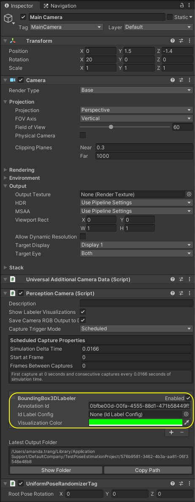
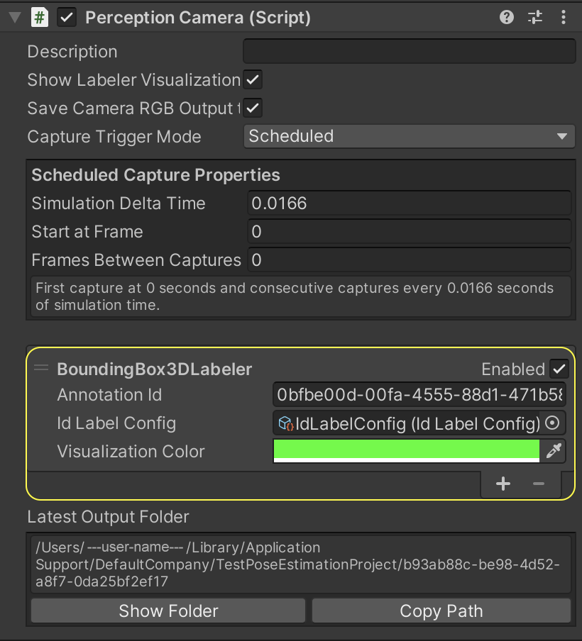
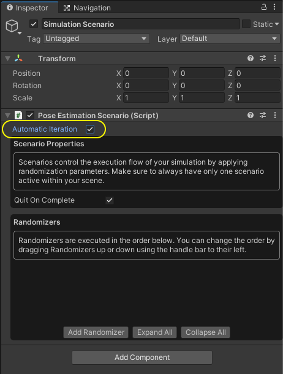
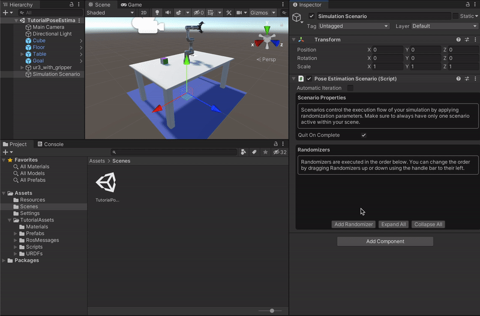
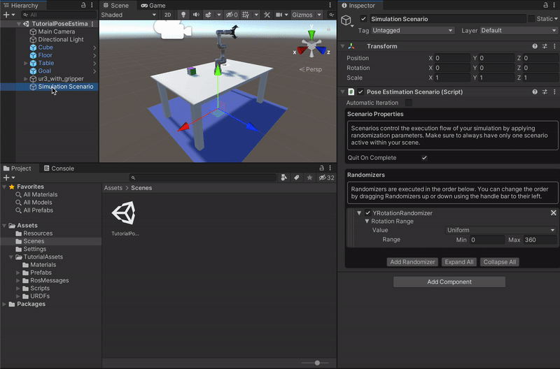

# Object Pose Estimation Tutorial: Part 2

In [Part 1](1_set_up_the_scene.md) of the tutorial, we learned:
* How to create a Unity Scene
* How to use the Package Manager to download and install Unity packages
* How to move and rotate objects in the Scene
* How to instantiate GameObjects with Prefabs
* How to import a robot from a URDF file  
    
You should now have a table, a cube, a camera, and a robot arm in your Scene. In this part we will prepare the Scene for data collection with the Perception package. 

<p align="center">

</p>

**Table of Contents**
  - [Equip the Camera for Data Collection](#step-1)
  - [Set Up Labelling and Label Configurations](#step-2)
  - [Add and Set Up Randomizers](#step-3)

---

### <a name="step-1">Equip the Camera for Data Collection</a>

The images you generate to train your deep learning model and the images you later use for inference during the pick-and-place task will need to have the same resolution. We will now set this resolution.

1. In the ***Game*** view, click on the dropdown menu in front of `Display 1`. Then, click **+** to create a new preset. Make sure `Type` is set to `Fixed Resolution`. Set `Width` to `650` and `Height` to `400`. The gif below depicts these actions. 

<p align="center">

</p>

We now need to add a few components to our camera in order to equip it for synthetic data generation. 

2. Select the `Main Camera` GameObject in the _**Hierarchy**_ tab and in the _**Inspector**_ tab, click on _**Add Component**_.

3. Start typing `Perception Camera` in the search bar that appears, until the `Perception Camera` script is found, with a **#** icon to the left.

4. Click on this script to add it as a component. Your camera is now a `Perception` camera.

5. From the top menu bar of the editor, go to `Edit > Project Settings > Editor` and uncheck `Asynchronous Shader Compilation` under `Shader Compilation` options.

In the ***Inspector*** view for the `Perception Camera` component, you can see an empty list (`List is Empty`). This is the list of Labelers. For each type of ground-truth you wish to generate alongside your captured frames, you will need to add a corresponding Labeler to this list. In our project we want to extract the position and orientation of an object, so we will use the `BoundingBox3DLabeler`. 

There are several other types of Labelers available, and you can even write your own. If you want more information on Labelers, you can consult the [Perception package documentation](https://github.com/Unity-Technologies/com.unity.perception).

6. In the _**Inspector**_ view of the `Perception Camera` component, click on the _**+**_ button at the bottom right corner of the `List is Empty` field, and select `BoundingBox3DLabeler`. 

This Labeler will annotate the captured output with 3D bounding boxes of GameObjects in the Scene that are labelled. If the `Perception Camera`'s `Show Labeler Visualizations` option is enabled, these bounding boxes will also be visualized in real-time in the ***Scene*** view as data is generated. We will next learn how to set up this Labeler.

Once you add the Labeler, the ***Inspector*** view of the `Perception Camera` component will look like this:

<p align="center">

</p>


### <a name="step-2">Set Up Labelling and Label Configurations</a>

Our work above prepares us to collect RGB images from the camera and associated 3D bounding boxes for objects in our Scene. However, we still need to specify _which_ objects we'd like to collect poses for using the Labeler we added. In this tutorial, we will only collect the pose of the cube, but you can add more objects if you'd like.

You will notice that the `BoundingBox3DLabeler` component has a field named `Id Label Config`. The label configuration we link here will determine which objects' poses get saved in our dataset. 

1.  In the _**Project**_ tab, right-click the `Assets` folder, then click `Create -> Perception -> Id Label Config`.

This will create a new asset file named `IdLabelConfig` inside the `Assets` folder.

This type of label configuration includes a list of labels, each with a numerical ID. By assigning this configuration to a Labeler, we tell the Labeler to only capture objects that carry labels that are included in the configuration's list of labels, and ignore the rest of the objects in the Scene. We will now assign this configuration the `BoundingBox3DLabeler` we just added to the `Perception Camera` component.

2. Select the `Main Camera` object from the _**Hierarchy**_ tab, and in the _**Inspector**_ tab, assign the newly created `IdLabelConfig` asset to the `Id Label Config` field. To do so, you can either drag and drop the former into the corresponding field of the Labeler, or click on the small circular button in front of the `Id Label Config` field, which brings up an asset selection window filtered to only show compatible assets. 

The `Perception Camera` component will now look like the image below:

<p align="center">

</p>

Now we need to assign a label to the `Cube` object, and add the same label to `IdLabelConfig`, since it is the pose of the cube we wish to collect. 

3. Select the `Cube` GameObject and in the _**Inspector**_ tab, click on the _**Add Component**_ button.

4. Start typing `Labeling` in the search bar that appears, until the `Labeling` script is found, with a **#** icon to the left. Click on this script. 

5. In the UI that appears, click the **Add New Label** button and change `New Label` to `cube_position`. Then, click on `Add to Label Config...`, and below `Other Label Configs in Project` there should be `IdLabelConfig`. Click on `Add Label` and then close the window. 

The `cube_position` label is now added to both the `Cube` object and the `IdLabelConfig` label configuration.

The _**Inspector**_ view of the `Cube` should look like the following:

<p align="center">

</p>


### <a name="step-3">Add and Set Up Randomizers</a>

#### Domain Randomization
We will be collecting training data from a simulation, but most real perception use-cases occur in the real world. 
To train a model to be robust enough to generalize to the real domain, we rely on a technique called [Domain Randomization](https://arxiv.org/pdf/1703.06907.pdf). Instead of training a model in a single, fixed environment, we _randomize_ aspects of the environment during training in order to introduce sufficient variation into the generated data. This forces the machine learning model to handle many small visual variations, making it more robust.

In this tutorial, we will randomize the position and the orientation of the cube on the table, and also the color, intensity, and position of the light. Note that the Randomizers in the Perception package can be extended to many other aspects of the environment as well.


#### The Scenario
To start randomizing your simulation, you will first need to add a **Scenario** to your Scene. Scenarios control the execution flow of your simulation by coordinating all Randomizer components added to them. If you want to know more about this, you can check out the corresponding section in the [Perception Tutorial](https://github.com/Unity-Technologies/com.unity.perception/blob/master/com.unity.perception/Documentation~/Tutorial/Phase1.md#step-5-set-up-background-randomizers). There are several pre-built Randomizers provided by the Perception package, but they don't fit our specific problem. Fortunately, the Perception package also allows one to write [custom Randomizers](https://github.com/Unity-Technologies/com.unity.perception/blob/master/com.unity.perception/Documentation~/Tutorial/Phase2.md), which we will do here.

1. In the _**Hierarchy**_, click the **+** button and select `Create Empty`. Rename the newly created GameObject `Simulation Scenario`.

2. Select the `Simulation Scenario` GameObject and in the _**Inspector**_ tab, click on the _**Add Component**_ button. Start typing `Pose Estimation Scenario` in the search bar that appears, until the `Pose Estimation Scenario` script is found, with a **#** icon to the left. Click on the script. 
   
3. Still in the _**Inspector**_ tab of the `Simulation Scenario` GameObject, ensure the `Automatic Iteration` flag is enabled.

<p align="center">

</p>

Each Scenario executes a number of Iterations, and each Iteration carries on for a number of frames. These are timing elements you can leverage in order to customize your Scenarios and the timing of your randomizations. 


#### Writing our Custom Object Rotation Randomizer
The randomization workflow involves two types of C# classes: Randomizers and RandomizerTags. Randomizers are added to the Scenario and perform the actual randomization tasks, while RandomizerTags are attached to objects in the scene, so that Randomizers know which objects to target. One Randomizer can target many different RandomizerTags.

First, we will write a Randomizer to randomly rotate the cube around its y-axis on each Iteration of the Scenario. 

4. In the _**Project**_ tab, right-click on the **Scripts** folder and select `Create -> C# Script`. Name your new script file `YRotationRandomizer`.

5. Create another script and name it `YRotationRandomizerTag`.

6. Double-click `YRotationRandomizer.cs` to open it in _**Visual Studio**_.

Note that while _**Visual Studio**_ is the default option, you can choose any text editor of your choice to open C# files from Unity. You can change this setting in _**Preferences -> External Tools -> External Script Editor**_.

7. Remove the contents of the class and copy/paste the code below:

```C#
using System.Collections;
using System.Collections.Generic;
using System;
using UnityEngine;
using UnityEngine.Perception.Randomization.Parameters;
using UnityEngine.Perception.Randomization.Randomizers;
using UnityEngine.Perception.Randomization.Samplers;


[Serializable]
[AddRandomizerMenu("Perception/Y Rotation Randomizer")]
public class YRotationRandomizer : Randomizer
{
    public FloatParameter rotationRange = new FloatParameter { value = new UniformSampler(0f, 360f)}; // in range (0, 1)

    protected override void OnIterationStart()
    {
        IEnumerable<YRotationRandomizerTag> tags = tagManager.Query<YRotationRandomizerTag>();
        foreach (YRotationRandomizerTag tag in tags)
        {
            float yRotation = rotationRange.Sample();

            // sets rotation
            tag.SetYRotation(yRotation);
        }
    }
}

```

The purpose of this piece of code is to rotate a set of objects randomly about their y-axes every Iteration. In Unity, the y-axis points "up". 

>Note: If you look at the ***Console*** tab of the editor now, you will see an error regarding `YRotationRandomizerTag` not being found. This is to be expected, since we have not yet created this class; the error will go away once we create the class later.

Let's go through the code above and understand each part:
* Near the top, you'll notice the line `[AddRandomizerMenu("Perception/Y Rotation Randomizer")]`. This will give the Randomizer a name in the UI which will be used when we add the Randomizer to our `Pose Estimation Scenario`. 
* The `YRotationRandomizer` class extends `Randomizer`, which is the base class for all Randomizers that can be added to a Scenario. This base class provides a plethora of useful functions and properties that can help catalyze the process of creating new Randomizers.
* The `FloatParameter` field contains a seeded random number generator. We can set the sampling range and the distribution of this value in the editor UI for the Randomizer. 
* The `OnIterationStart()` function is a life-cycle method on all `Randomizer`s. It is called by the Scenario every Iteration (e.g. once per frame, if each Iteration runs for one frame). 
* The `tagManager` is an object available to every `Randomizer` which helps us find GameObjects tagged with a given `RandomizerTag`. In our case, we query the `tagManager` to gather references to all the `YRotationRandomizerTag`s currently present in the Scene.
* We then loop through these `tags` to rotate the object that each tag is attached to:
    * `rotationRange.Sample()` gives us a random float in the specified range.
    * We then rotate this object using the `SetYRotation()` method of the tag, which we will write in a moment.

8. Open `YRotationRandomizerTag.cs` and replace its contents with the code below:

```C#
using UnityEngine;
using UnityEngine.Perception.Randomization.Randomizers;

public class YRotationRandomizerTag : RandomizerTag
{
    private Vector3 originalRotation;

    private void Start()
    {
        originalRotation = transform.eulerAngles;
    }

    public void SetYRotation(float yRotation)
    {
        transform.eulerAngles = new Vector3(originalRotation.x, yRotation, originalRotation.z);
    }
}

```
The `Start` method is automatically called once, at runtime, before the first frame. Here, we use the `Start` method to save this object's original rotation in a variable. When `SetYRotation` is called by the Randomizer every Iteration, it updates the rotation around the y-axis, but keeps the x and z components of the rotation the same. 


#### Adding our Custom Object Rotation Randomizer

If you return to your list of Randomizers in the Inspector view of `Simulation Scenario`, you can now add this new Randomizer.

9. Add `YRotationRandomizer` to the list of Randomizers in `Simulation Scenario` (see the gif after the next action). You will notice that you can adjust the sampling distribution and range of `Rotation Range` here, as mentioned above.

<p align="center">

</p>

10. Select the `Cube` GameObject and in the _**Inspector**_ tab, add a `YRotationRandomizerTag` component. 

<p align="center">

</p>


11. Run the simulation by clicking the **▷** (play) button located at the top middle section of the editor, and inspect how the cube now switches between different orientations. You can pause the simulation and then use the step button (to the right of the pause button) to move the simulation one frame forward and clearly see the the cube's y-rotation changing. You should see something similar to the following. Note that the 3D bounding box visualization does not update as you step through frames, but this does not affect the output.

<p align="center">

</p>

#### Randomizing Object Positions

It is great that we can now rotate the cube, but we also want to move it around the table. However, not all positions on the table are valid - we also need it to be within the robot arm's reach. 

To save time, we have provided a pre-written custom Randomizer to do this. 

12. Select the `Simulation Scenario` GameObject, and do the following:
    * In the _**Inspector**_ tab, on the `Pose Estimation Scenario` component, click `Add Randomizer` and start typing `RobotArmObjectPositionRandomizer`. 
    * Set `Min Robot Reachability` to `0.2` and `Max Robot Reachability` to `0.4`. 
    * On the `Plane` field, click on the circular button to the right side and start typing `ObjectPlacementPlane` and then double click on the GameObject that appears. 
    * Drag and drop the base of the robot from the ***Hierarchy*** (the `ur3_with_gripper/world/base_link/base` object) to the `Robot Base` field.

<p align="center">

</p>

13.  Now we need to add the corresponding RandomizerTag to the cube. 
    * Select the `Cube` GameObject and in the _**Inspector**_ tab, click on the _**Add Component**_ button. Start typing `RobotArmObjectPositionRandomizerTag` in the search bar that appears, until the `RobotArmObjectPositionRandomizerTag` script is found, with a **#** icon to the left. Click on the script. 
    * In the UI for this new component, enable the `Must Be Reachable` property. 

The `RobotArmObjectPositionRandomizerTag` component should now look like this:

<p align="center">

</p>

If you press **▷** (play) now, you should see the `Cube` and `Goal` objects moving around the robot with the cube rotating on each frame.

<p align="center">

</p>

#### Light Randomizer

Now we will add another Randomizer to introduce some variation into the Scene's lighting. 

14.  Select the `Simulation Scenario` GameObject and in the _**Inspector**_ tab, on the `Pose Estimation Scenario` component, click on `Add Randomizer` and start typing `LightRandomizer`. 
    * For the range parameter of `Light Intensity Parameter`, set `Min` to `0.9` and `Max` to `1.1`. 
    * For the range parameter of `Rotation X`, set `Min` to `40` and `Max` to `80`. 
    * For the range parameter of `Rotation Y`, set `Min` to `-180` and `Max` to `180`. 
    * For the range parameters of `Red`, `Green` and `Blue` inside of `Light Color Parameter`, set `Min` to `0.5`. 
    
The Randomizer should now look like this: 

<p align="center">

</p>

15.  Now we need to add a RandomizerTag to the light. Select the `Directional Light` GameObject and in the _**Inspector**_ tab, click on the _**Add Component**_ button. Start typing `LightRandomizerTag` in the search bar that appears, until the `LightRandomizerTag` script is found, with a **#** icon to the left. Click the script.

To view this script, you can right click on the three dots at the right end and select `Edit Script`. 
This Randomizer is a bit different from the previous ones. The line `[RequireComponent(typeof(Light))]` makes it so that you can only add the `LightRandomizerTag` component to an object that already has a **Light** component attached. This way, the Randomizers that query for this tag can be confident that the found objects have a **Light** component.

If you press play, you should see that the color, direction, and intensity of the lighting now change with each frame.

<p align="center">

</p>

### Proceed to [Part 3](3_data_collection_model_training.md).

### Go back to [Part 1](1_set_up_the_scene.md)
