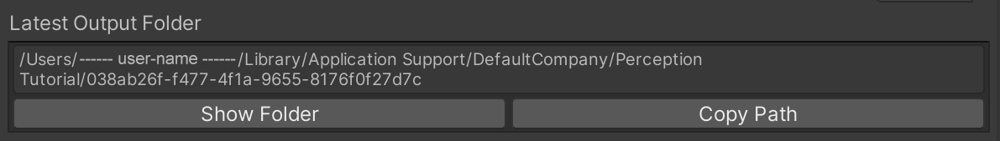
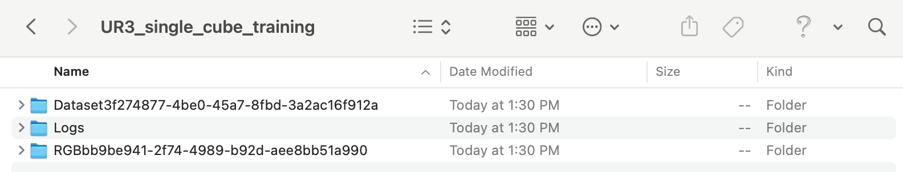

# Object Pose Estimation Tutorial: Part 3

In [Part 1](1_set_up_the_scene.md) of the tutorial, we learned how to create our Scene in Unity Editor.

In [Part 2](2_set_up_the_data_collection_scene.md) of the tutorial, we learned:
* How to equip the camera for the data collection
* How to set up labelling and label configurations
* How to create your own Randomizer 
* How to add our custom Randomizer  

In this part, we will be collecting a large dataset of RGB images of the Scene, and the corresponding pose of the cube. We will then use this data to train a machine learning model to predict the cube's position and rotation from images taken by our camera. We will then be ready to use the trained model for our pick-and-place task in [Part 4](4_pick_and_place.md).

Steps included in this part of the tutorial:

**Table of Contents**
  - [Collect the Training and Validation Data](#step-1)
  - [Train the Deep Learning Model](#step-2)
  - [Exercises for the Reader](#exercises-for-the-reader)

---

## <a name="step-1">Collect the Training and Validation Data</a>

Now it is time to collect the data: a set of images with the corresponding position and orientation of the cube relative to the camera.

We need to collect data for the training process and data for the validation one. 

We have chosen a training dataset of 30,000 images and a validation dataset of 3,000 images. 

1. Select the `Simulation Scenario` GameObject and in the _**Inspector**_ tab, make sure `Automatic Iteration` is enabled. When this flag is enabled, our Scenario automatically proceeds through Iterations, triggering the `OnIterationStart()` method of all Randomizers on each Iteration. When this flag is disabled, the Iterations would have to be triggered manually. 

2. In the ***Inspector*** view of  `Pose Estimation Scenario`, set the `Total Frames` field under `Constants` to 30000.

3. Press play and wait until the simulation is done. It should take a bit of time (~10 min).

4. Select `Main Camera` again to bring up its _**Inspector**_ view. At the bottom of the UI for `Perception Camera`, there are buttons for showing the latest dataset output folder and copying its path to clipboard. An example is shown below (Mac OS):

<p align="center">

</p>

5. Click _**Show Folder**_ to show and highlight the folder in your operating system's file explorer.

6. Change this folder's name to `UR3_single_cube_training`.   

7. Enter the folder

You should then see something similar to this: 
<p align="center">

</p>

Now we need to collect the validation dataset. 

8. Back in Unity Editor, Select the `Simulation Scenario` GameObject and in the _**Inspector**_ tab, in `Pose Estimation Scenario`, set the `Total Frames` field under `Constants` to 3000.

9. Press play and wait until the simulation is done. Once the simulation finishes, follow the same steps as before to navigate to the output folder.

10. Change the folder name where the latest data was saved to `UR3_single_cube_validation`. 

11. **(Optional)**: Move the `UR3_single_cube_training` and `UR3_single_cube_validation` folders to a directory of your choice.  


## <a name="step-2">Train the Deep Learning Model</a>
Now it's time to train our deep learning model! We've provided the model training code for you, but if you'd like to learn more about it - or make your own changes - you can dig into the details [here](../Model).

This step can take a long time if your computer doesn't have GPU support (~5 days on CPU). Even with a GPU, it can take around ~10 hours. We have provided an already trained model as an alternative to waiting for training to complete. If you would like to use this provided model, you can proceed to [Part 4](4_pick_and_place.md).

1. Navigate to the `Robotics-Object-Pose-Estimation/Model` directory.

### Requirements

We support two approaches for running the model: Docker (which can run anywhere) or locally with Conda. 

#### Option A: Using Docker
If you would like to run using Docker, you can follow the [Docker steps provided](../Model/documentation/running_on_docker.md) in the model documentation.


#### Option B: Using Conda 
To run this project locally, you will need to install [Anaconda](https://docs.anaconda.com/anaconda/install/) or [Miniconda](https://docs.conda.io/en/latest/miniconda.html). 

If running locally without Docker, we first need to create a Conda virtual environment and install the dependencies for our machine learning model. If you only have access to CPUs, install the dependencies specified in the `environment.yml` file. If your development machine has GPU support, you can choose to use the `environment-gpu.yml` file instead.

2. In a terminal window, enter the following command to create the environment. Replace `<env-name>` with an environment name of your choice, e.g. `pose-estimation`:
```bash
conda env create -n <env-name> -f environment.yml
```

Then, you need to activate the Conda environment.

3. Still in the same terminal window, enter the following command:
```bash
conda activate <env-name>
```

### Updating the Model Config

At the top of the [cli.py](../Model/pose_estimation/cli.py) file in the model code, you can see the documentation for all supported commands. Since typing these in can be laborious, we use a [config.yaml](../Model/config.yaml) file to feed in all these arguments. You can still use the command line arguments if you want - they will override the config. 

There are a few settings specific to your setup that you'll need to change.

First, we need to specify the path to the folders where your training and validation data are saved:

4. In the [config.yaml](../Model/config.yaml), under `system`, you need to set the argument `data/root` to the path of the  directory containing your data folders. For example, since I put my data (`UR3_single_cube_training` and `UR3_single_cube_validation`) in a folder called `data` in Documents, I set the following:
```bash
  data_root: /Users/<user-name>/Documents/data
```

Second, we need to modify the location where the model is going to be saved: 

5. In the [config.yaml](../Model/config.yaml), under `system`, you need to set the argument `log_dir_system` to the full path of the output folder where your model's results will be saved. For example, I created a new directory called `models` in my Documents, and then set the following:
```bash
log_dir_system: /Users/<user-name>/Documents/models
```

### Training the model

6. If you are not already in the `Robotics-Object-Pose-Estimation/Model` directory, navigate there. 

7. Enter the following command to start training: 
```bash 
python -m pose_estimation.cli train 
```

>Note (Optional): If you want to override certain training hyperparameters, you can do so with additional arguments on the above command. See the documentation at the top of [cli.py](../Model/pose_estimation/cli.py) for a full list of supported arguments.

>Note: If the training process ends unexpectedly, check the [Troubleshooting Guide](troubleshooting.md) for potential solutions.

### Visualizing Training Results with Tensorboard
If you'd like to examine the results of your training run in more detail, see our guide on [viewing the Tensorboard logs](../Model/documentation/tensorboard.md).

### Evaluating the Model
Once training has completed, we can also run our model on our validation dataset to measure its performance on data it has never seen before. 

However, first we need to specify a few settings in our config file.

8. In [config.yaml](../Model/config.yaml), under `checkpoint`, you need to set the argument `log_dir_checkpoint` to the path where you have saved your newly trained model.

9. If you are not already in the `Robotics-Object-Pose-Estimation/Model` directory, navigate there.

10. To start the evaluation run, enter the following command: 
```bash 
python -m pose_estimation.cli evaluate 
```

>Note (Optional): To override additional settings on your evaluation run, you can tag on additional arguments to the command above. See the documentation in [cli.py](../Model/pose_estimation/cli.py) for more details.


### Exercises for the Reader
**Optional**: If you would like to learn more about Randomizers and apply domain randomization to this scene more thoroughly, check out our further exercises for the reader [here](5_more_randomizers.md).

### Proceed to [Part 4](4_pick_and_place.md).

### 

### Go back to [Part 2](2_set_up_the_data_collection_scene.md)
